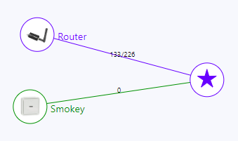

# Tracking signal quality

The `Devices` page seems to carry old LQI (signal quality) information, or refresh it really seldom.

A better (real) view is gotten by the `Map` feature:



Here, Router gets `133/226`.

>Asking on Discord, the two numbers are in/out (either way)


## Ways to improve coverage

You've likely thought about the usual ones:

- USB extension cord
- antenna placement

### Pumping up Power

The "E" sticks allow setting output power to 20 dBm (from default 5). Note that this *only affects outgoing traffic* - not listening - and therefore the conservative value may be better. 

>IF we have a way to flash the routers with 20 dBm, that may be useful. Even then, the results need to be measured.

**Controller**

Add in `configuration.yaml`: 

```yaml
advanced:
  transmit_power: 20
```

**Router**

ChatGPT (well, Bing conversation) knows to tell that the Sonoff "P" router image is set to 9dbM (instead of normal 5), but don't have info on the "E" router image.

= this **likely** requires changing the parameters before flashing the router device.

**Results**

With a simple controller <-> router in neighbouring rooms:

|dbM||
|---|---|
|5|193/232, 193/235, 193/235|
|20|189/216, 200/236, 205/224|

*Between measurements, the controller process was completely restarted. The values are from the `Map` page.*

Based on this sample, pumping up power may even have a negative effect on signal quality.

<!--
>More study needed, especially in situations where the two are father apart.
-->

<!-- tbd.
- [ ] Is the first number signal strength at router, or vice versa?
-->
