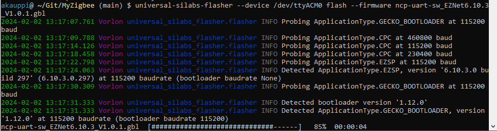

# Flashing

Not sure, whether it would be good to start by flashing the device with a controller firmware.

Pro:
- always good to have a reproducible process

Cons:
- USB stick comes with controller pre-flashed. It should just work.

>It didn't "just work". Zigbee2MQTT didn't recognize my `dev/ttyZIGBEE` and - though it may not be because of the firmware - I decided to flash.

## What's the starting situation?

I want to know the starting situation. Likely the stick has the ITeal / Sonoff official image, but how to know?

---

[Dongle-E Zigbee NCP Firmware](https://github.com/itead/Sonoff_Zigbee_Dongle_Firmware/tree/master/Dongle-E/NCP) (GitHub) is an interesting page worth reading!

>Got to that page through a link and a link... Felt like a subscript, really..

TL;DR:

- >"[..] firmware with Silicon Labs standard EZSP (EmberZNet Serial Protocol) interface."

   I think this means the pre-flashed image should carry EZSP.

- >At the time of writting (2022-06-30) EmberZNet Zigbee version 6.10.3.0 firmware [...] 

   I can expect "6.10.3.0" to be on my dongle..

- >[..] EZSP v5, v6 and v7 (EmberZNet 6.6.x.x) use the same framing format, but **EmberZNet 6.7.x.x/EZSP v8** introduced new framing format and expanded command id field from 8 bits to 16 bits.

   I can expect the version of EZSP to be >= 8.

Let's take the `.gbl` file on that page and flash it!

>```
> $ file ncp-uart-sw_EZNet6.10.3_V1.0.1.gbl
ncp-uart-sw_EZNet6.10.3_V1.0.1.gbl: DOS executable (COM)
>```
>
>Interesting.


## Ways to flash

### `universal-silabs-flasher`

Study [`unversal-silabs-flasher` page](https://pypi.org/project/universal-silabs-flasher/).

```
$ pip install universal-silabs-flasher
```

>Needed to close & reopen WSL windows to see `universal-silabs-flasher`.

```
$ universal-silabs-flasher --device /dev/ttyACM0 flash --firmware ncp-uart-sw_EZNet6.10.3_V1.0.1.gbl
```



That seemed to work!

>This proves that:
>
>- the device is accessible from within WSL
>- the device is ..well.. up
>- it had `version '6.10.3.0 build 297' (6.10.3.0.297)` pre-flashed

### Web flasher (not tried!)

[This discussion](https://dialedin.com.au/blog/sonoff-zbdongle-e-rcp-firmware).


## References

- [universal-silabs-flasher](https://pypi.org/project/universal-silabs-flasher/) (pypi.org)

- [`SONOFF-Zigbee-3.0-USB-dongle-plus-firmware-flashing-.pdf`](https://sonoff.tech/wp-content/uploads/2022/07/SONOFF-Zigbee-3.0-USB-dongle-plus-firmware-flashing-.pdf) (PDF, xx pp., Jul'22)

   Sonoff official(?) advice on firmware flashing.

   On controller, [points to here](https://github.com/itead/Sonoff_Zigbee_Dongle_Firmware/tree/master/Dongle-E/NCP)

   "[..] with Silicon Labs standard EZSP (EmberZNet Serial Protocol) interface."

   <!-- 
   This looks interesting.. Much better than the other (ITead/Sonoff) page that just has a `.gbl` - and a typo. :]
   -->
