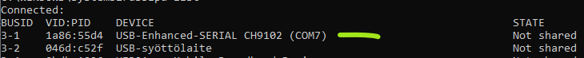

# My Zigbee

How I set up a minor Zigbee network, with:

- [zigbee2mqtt](https://github.com/Koenkk/zigbee2mqtt)

  .. running within Docker, under Windows 10 Home

## Design criteria

### Safety

I don't want to give the Docker container `privileged: true` rights (i.e. ability to do anything
with the host Windows), or `networking: host` for that matter.

Instead, we bridge the dongle to WSL using USB/IP.

### Persistence

<!-- !todo REMOVE
`./store` folder is used for the state of `zwave-js-ui`, so that is on the WSL file system instead of within the container.
-->

## Requires

- WSL2 (requirement also for Docker)
- [`usbipd-win`](https://github.com/dorssel/usbipd-win) installed

### Hardware used

- [Sonoff Zigbee Dongle Plus <big>E</big>](https://www.proshop.fi/Smart-Home-Aelykoti/Sonoff-ZigBee-Gateway-ZigBee-30-USB-Dongle-Plus-E/3213488) - (Proshop; distributor)

- [Schneider / Wiser smoke alarm](https://www.zigbee2mqtt.io/devices/W599001.html) (Zigbee2MQTT > Devices)


## Prepare

### Driver install (`CH343`)

>*"Windows and macOS require corresponding driver installation."*

Download from Sonoff (Windows): [link to zip](http://sonoff.tech/wp-content/uploads/2022/07/CH343SER.zip)

<!-- hidden
The link is from https://sonoff.tech/product-review/how-to-use-sonoff-dongle-plus-on-home-assistant-how-to-flash-firmware/) (visited 1-Feb-24 .
-->

>⚠️ Warn! Installing a driver is always a risk on your system. You don't really have a choice here, though.
>
>The zip contains a `LIB` folder with some sources, but there's no saying that the binaries (under `DRIVER`, with some awkward fodlers like `WIN1X`) match those. INSTALL ANY DRIVER AT YOUR OWN RISK!

- unzip
- either run the `SETUP.EXE`
- ..or right-click on the `.INF` file and > `Install`

>Running `SETUP.EXE` brought up a Windows safety dialog. The author yielded; installed by the `.INF`.

Sonoff gives 0 guidance; likely they assume one to just shoot `SETUP` with no safety concerns. Yeah - that's the way to save the world.

---

>Note: Device Manager showed the driver the same before and after install, but `usbipd list` shows a difference:
>
>before 
>
>after 

---

### Install `usbipd` on Windows host

>This is covered in [MyZWave](...).


## Steps

1. Attach the USB stick to WSL

   In an admin `cmd.exe` prompt:

   ```
   >usbipd list
   Connected:
   BUSID  VID:PID    DEVICE
   3-1    1a86:55d3  USB-Enhanced-SERIAL CH9102 (COM7)
   [...snipped]
   ```

   ```
   >usbipd bind -b 3-1
   ```

   ```
   > usbipd attach --wsl -b 3-1
   usbipd: info: Using WSL distribution 'Ubuntu' to attach; the    device will be available in all WSL 2 distributions.
   usbipd: info: Using IP address 172.25.32.1 to reach the host.
   ```

   Within WSL, see that the device is seen:

   ```
   $ lsusb
   [...]
   Bus 001 Device 002: ID 1a86:55d4 QinHeng Electronics SONOFF Zigbee 3.0 USB Dongle Plus V2
   [...]
   ```

2. Launch the Docker container

   ```
   $ docker compose up zigbee2mqtt
   ```

      

   Leave the software running.

3. Open [localhost:8091](http://localhost)

   
   
   >In Z-Wave, the controller remembers the devices it's been paired with.

4. Attach the devices

   <font color=red>tbd. Missing</font>

5. `Control Panel` > (device) > `Values`

   

   Note the `5-37-0` id - you can use it to script the particular device.

   >Note: Press `Configure` > `Get` if the above doesn't show.

6. `Settings` > `General` > `Scheduled jobs`

   

   >NOTE!! When you do changes here - or ANY Zwave-JS-UI settings, THEY DON*T REMAIN EFFECTIVE UNLESS YOU PRESS `SAVE` AT THE BOTTOM OF THE PAGE. MAKE IT A HABIT!

   - `+ NEW VALUE`
   - Enter suitable name, cron syntax and as the script e.g. 

   

   >Note: Naturally, use the id's from the visit to the control panel, e.g. `5`, `37`, `0`.

7. `Settings` > `Disable MQTT Gateway`

   Doesn't matter but we don't need it.

7. `Debug`

   Observe that the schedules happen.

## Gotchas

### Editing scripts

You *can* edit scripts, but it has some glitches / UX weirdness:

- Cursor seems to disappear when it's at the left edge (merges with the border)

   Work-around: indent *all* lines with one space!

- Read `EDIT` button as "save". That's what it does.

- After the "edit-save", STILL REMEMBER TO `SAVE` the whole `Settings` > `General` tab, before exiting the `Settings` area. THE UI DOES LOSE UNCHANGED CHANGES!

>Note. Don't know what happens if there are syntax errors in  

## Summary?

Having explored ZWave a bit, the author is:

- pleased with ZWave-JS-UI, at least for:
   - detecting and managing ZWave nodes

- ..knows that the nodes can be automated with it, but **with restrictions**
   - there's no good reference on how to write a "driver" (scheduled command) for a said device. 
   - there's no visual indication if a string is syntactically correct, or not
   - UX details (mentioned above) about editing schedules make it a bit.. unpleasant

For these reasons, I will likely

- set up the system with this *for now*. 
- look into ZWave command-line scheduling possibilities, using Rust.

There was no need for Home Assistant, whatsoever. It could be removed from the `docker-compose.yml`; or you could tell, how the two can be made to co-operate.

## Appendices

Things to help. Notes.

## Usability hint

The hamburger menu at lower right corner **changes based on which left-side tab you're on!!** This may be confusing at best.

## Adding devices

To add a device:

- Select "Control panel" (default view) from left tab
- Open `☰` > `Manage nodes`

   

- Enter the names; triple-click the device once the UI waits for inclusion. Should be fast and clear.

## Remember to update!

Docker doesn't automatically pull `:latest`. Every now and then:

- `docker compose down`
- Pull new from Docker UI, or manually
- `docker compose up zwave-js-ui`

Only way to get updates!


-->

## Notes

- I don't use a "1,5m USB extension cable".  Ideally, one could, to bring the radio source further from a PC.

### Quality in 🇨🇳

Whereas some manufacturers, Espressif in particular!, provide completely great, global quality coming from China, Sonoff leaves things lacking, in documentation and attention to (English) detail.

**Driver installation**

The experience is shady, at best.
 
**Open source software**

[Firmware page](https://github.com/itead/Sonoff_Zigbee_Dongle_Firmware/tree/master/Dongle-E/Router) on GitHub:


>Am I being picky here?
>
>But this doesn't raise confidence a single bit. And we should be able to trust vendors on a) their hardware, b) the software, c) the documentation.

So far, giving Sonoff only ⭐️⭐️⭐️ stars out of 5.


## Additional

<!-- tbd.
### Second dongle as repeater

https://sonoff.tech/wp-content/uploads/2023/02/SONOFF-Zigbee-3.0-USB-dongle-plus-firmware-flashing.pdf
-->


## References

- [Zigbee 3.0 USB Dongle Plus](https://sonoff.tech/product/gateway-and-sensors/sonoff-zigbee-3-0-usb-dongle-plus-e/)

   Sonoff product page. Recommended to browse through **before** starting the use!  Has nice comparison with their earlier model, etc.

- [Instructions on SparkFun](https://learn.sparkfun.com/tutorials/how-to-install-ch340-drivers/windows-710)

   ..show some screenshots and how to validate the driver has installed in Device Manager. 
